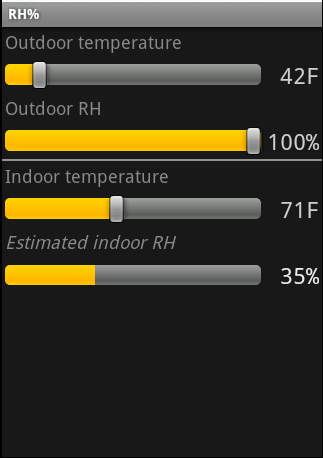

# Guesstimators

## IndoorRH --- indoor humidity estimates
### How dry indoor air can be during winter?

We wonder why the air inside being so dry once the heat is turned on in the winter. Even when it has been raining for days, the indoor humidity is still arid. This simple Android app will estimate the indoor relative humidity assuming the air indoors has the same moisture content as the air outside (we open the windows a little for ventilation).

